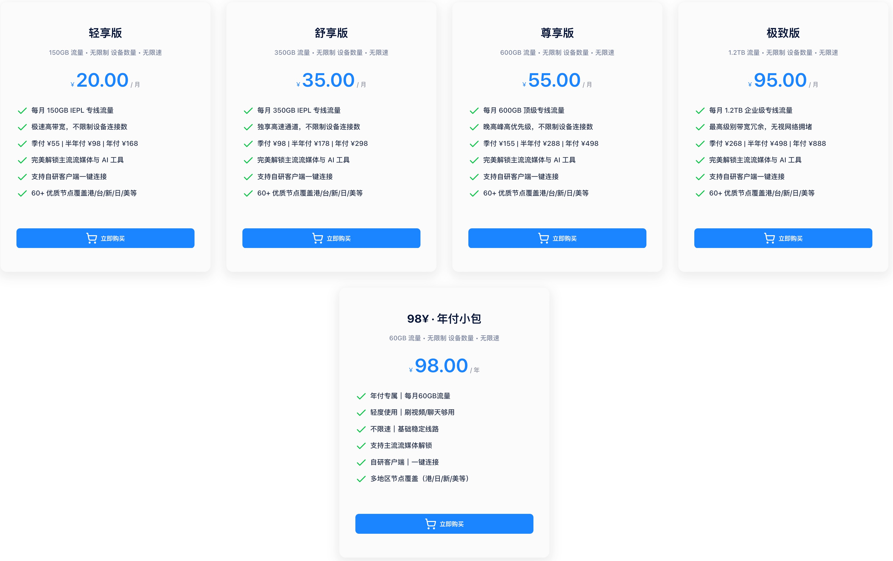
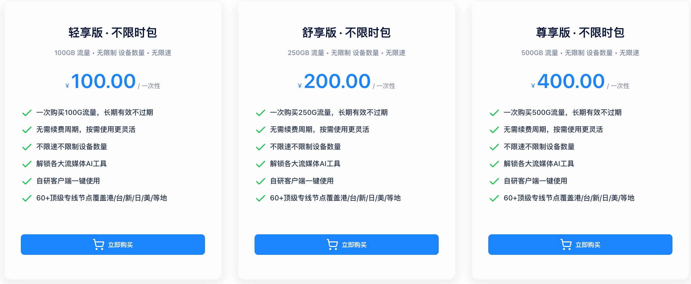

# 一翻云机场官网最新地址+优惠码

## 机场推荐【一翻云】- IEPL专线高速节点，不限设备连接数

一翻云机场成立于2026年4月，采用IEPL专线架构，加密透传入口，直连与海外中转落地。提供60+优质节点覆盖香港、台湾、新加坡、日本、美国等地，支持主流流媒体与AI工具全解锁。不限设备连接数，支持自研客户端一键连接及第三方通用客户端。

一翻云官网地址：[一翻云](https://c.jichangs.com/yifan)

## 一翻云机场官网地址

[一翻云](https://c.jichangs.com/yifan)

## 一翻云机场简介

- ⚡️IEPL专线，加密透传入，直连+海外中转落地
- 🚀不限设备连接数，极速高带宽
- 🔒支持VLESS协议，加密传输保护隐私
- ⏰可选月付、年付、不限时多种方案
- 🎥全流媒体解锁：Netflix、Disney+、HBO、TVB等
- 🤖AI工具解锁：ChatGPT等全可用
- 🌏60+节点覆盖港/台/新/日/美
- 🛠支持客服定制个性化线路

## 一翻云套餐价格

| 套餐 | 价格 | 流量 | 设备数 |
| :---: | :---: | :---: | :---: |
| 年付套餐 | 96元/年 | 60G/月 | 不限 |
| 月付套餐 | 20元/月 | 150G/月 | 不限 |
| 不限时套餐 | 100元 | 100G | 不限 |
| IEPL季付 | 55元/季 | - | 不限 |
| IEPL半年付 | 98元/半年 | - | 不限 |
| IEPL年付 | 168元/年 | - | 不限 |

## 一翻云机场常规套餐价格

## 一翻云机场不限时套餐价格

